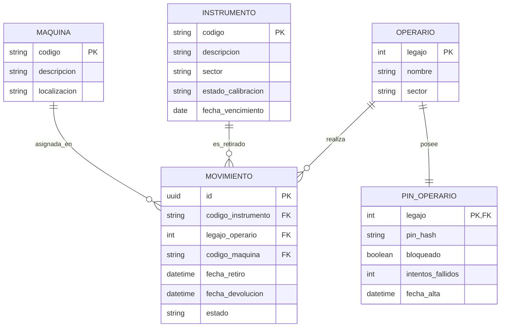

# Especificación 3: Extracción de Datos y Estrategia de Duplicado de Google Sheets

## 1. Resumen de la Extracción de Datos (Data Dump)

Con fecha 14 de Agosto de 2026, se ejecutó un script de consulta sobre la URL original de Google Apps Script:
`https://script.google.com/macros/s/AKfycbwRVpnQ-LlsG52PAZOw_EICEjNwC8ApEWltFHWScphH4JjjYeCb_agx59wws8xGzInj9w/exec`

Los datos extraídos fueron consolidados y respaldados en el archivo:
`spec/original_data_dump.json` (Tamaño: 170.3 KB).

### Estadísticas del Insumo Extraído:
- **Total de Instrumentos de Medición**: 897 registros completos.
  - Campos recuperados por instrumento: `c` (Código), `n` (Nombre/Descripción), `s` (Sector asignado), `e` (Estado de Calibración: *CALIBRADO*, *POR VENCER*, *VENCIDO*, *NO APLICA*, *PRÓXIMO A CALIBRAR*).
- **Control de Vencimientos de Calibración**: 180 registros con fechas y días restantes.
- **Instrumentos Actualmente en Uso**: 0 (Estado limpio para inicio de pruebas).
- **Operarios con PIN Registrado**: 2 registros de prueba preexistentes.

---

## 2. Estrategia de Trabajo con Copia de Seguridad (Staging / Dev)

Para cumplir con la directiva estricta de **no modificar ni alterar la plantilla original del metrólogo**, se establece el siguiente procedimiento:

### Paso 1: Duplicación del Documento en Google Drive
1. Abrir el libro de Google Sheets original utilizado por el metrólogo.
2. Ir a `Archivo` -> `Hacer una copia`.
3. Renombrar la copia como: `[DEV] CUSTODIA DE INSTRUMENTOS _ MICRO`.
4. Guardar en una carpeta de desarrollo en Google Drive.

### Paso 2: Configuración del Entorno de Desarrollo
Para interactuar con la copia sin interferir en producción, existen dos caminos:

- **Opción A (Recomendada - Google Sheets API v4 oficial)**:
  1. Crear un proyecto en Google Cloud Console.
  2. Habilitar la `Google Sheets API`.
  3. Crear una **Cuenta de Servicio (Service Account)** y descargar la clave JSON de credenciales.
  4. Compartir la copia de Google Sheets con el email de la Cuenta de Servicio (con permisos de Editor).
  5. Configurar las variables de entorno `.env` de la nueva app con las credenciales de la Service Account y el `SPREADSHEET_ID` de la copia.

- **Opción B (Implementar nuevo Apps Script en la copia)**:
  1. En la copia de Google Sheets, ir a `Extensiones` -> `Apps Script`.
  2. Pegar el código del script y desplegar como Web App (`Cualquier persona` / `Anyone`).
  3. Reemplazar la constante `SCRIPT_URL` en el entorno de desarrollo con la nueva URL obtenida.

---

## 3. Modelo de Datos Unificado para la Nueva App

El nuevo sistema estructurará la información en entidades claras:

