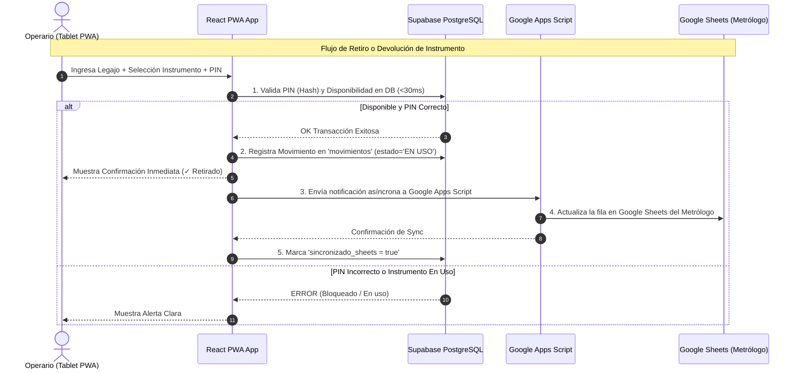

# Especificación 5: Arquitectura de Software, Esquema Supabase, Diseño UI y Motor de Sincronización

## 1. Principios de Diseño de Software y Requerimientos Estéticos

Para cumplir estrictamente con los requerimientos del usuario (**Simplicidad + Funcionalidad + Seguridad + Mantenibilidad por personal no técnico + Calco de Diseño en Fase 1**):

1. **Diseño Visual 1:1 respecto al HTML Original**:
   - Se utilizarán **únicamente estilos CSS Vanilla** (sin TailwindCSS ni librerías de UI externas).
   - Se migrará el bloque `<style>` de `custodia_instrumentos.html` de forma limpia y organizada a la carpeta `src/styles/`.
   - Mantiene la paleta de colores corporativos de **MiCRO Automatización** (`--blue: #01b2fe`, `--blue-d: #0090d0`, etc.), tipografía, tarjetas, botones, badges y layouts del MVP original.

2. **Arquitectura Modular Simplificada (Estilo MVC / Service-Layer)**:
   - `src/components/`: Vistas y componentes UI limpios (Operario, PIN, Teclado Táctil, Admin Dashboard).
   - `src/styles/`: Archivos CSS Vanilla modularizados (variables, header, operario, admin, modales).
   - `src/services/`: Capa de servicios para comunicación con Supabase y Google Apps Script.
   - `src/types/`: Definiciones de TypeScript para autocompletado y prevención de errores.
   - `src/context/`: Estado global liviano (sesión de operario y estado de la app).

3. **Política de Dependencias Mínimas (Zero-Bloat)**:
   - Solo se instalarán las librerías indispensables:
     - `react` y `react-dom` (UI core)
     - `@supabase/supabase-js` (Cliente de la base de datos)
     - `vite-plugin-pwa` (Soporte PWA e instalabilidad)

---

## 2. Esquema de Base de Datos PostgreSQL (Supabase)

La base de datos PostgreSQL en Supabase actuará como la **fuente de verdad primaria** para garantizar transacciones instantáneas (<30ms) y evitar condiciones de carrera en el taller.

```sql
-- 1. Tabla de Operarios
CREATE TABLE IF NOT EXISTS operarios (
    legajo INT PRIMARY KEY,
    nombre VARCHAR(150) NOT NULL,
    sector VARCHAR(100) NOT NULL,
    activo BOOLEAN DEFAULT TRUE,
    created_at TIMESTAMPTZ DEFAULT NOW()
);

-- 2. Tabla de PINs de Seguridad (Con Hashing)
CREATE TABLE IF NOT EXISTS pines_operarios (
    legajo INT PRIMARY KEY REFERENCES operarios(legajo) ON DELETE CASCADE,
    pin_hash VARCHAR(255) NOT NULL,
    intentos_fallidos INT DEFAULT 0,
    bloqueado BOOLEAN DEFAULT FALSE,
    ultimo_uso TIMESTAMPTZ,
    created_at TIMESTAMPTZ DEFAULT NOW()
);

-- 3. Tabla de Máquinas / Celdas CNC
CREATE TABLE IF NOT EXISTS maquinas (
    codigo VARCHAR(50) PRIMARY KEY,
    descripcion VARCHAR(200) NOT NULL,
    localizacion VARCHAR(100) NOT NULL,
    activa BOOLEAN DEFAULT TRUE
);

-- 4. Tabla de Instrumentos de Medición
CREATE TABLE IF NOT EXISTS instrumentos (
    codigo VARCHAR(50) PRIMARY KEY,
    nombre VARCHAR(250) NOT NULL,
    sector VARCHAR(100) NOT NULL,
    estado_calibracion VARCHAR(50) NOT NULL, -- 'CALIBRADO', 'POR VENCER', 'VENCIDO', 'NO APLICA'
    dias_restantes INT,
    fecha_vencimiento DATE,
    updated_at TIMESTAMPTZ DEFAULT NOW()
);

-- 5. Tabla Transaccional de Movimientos (Retiros y Devoluciones)
CREATE TABLE IF NOT EXISTS movimientos (
    id UUID PRIMARY KEY DEFAULT gen_random_uuid(),
    codigo_instrumento VARCHAR(50) REFERENCES instrumentos(codigo),
    legajo_operario INT REFERENCES operarios(legajo),
    codigo_maquina VARCHAR(50),
    descripcion_maquina VARCHAR(200),
    fecha_retiro TIMESTAMPTZ NOT NULL DEFAULT NOW(),
    fecha_devolucion TIMESTAMPTZ,
    estado VARCHAR(20) NOT NULL DEFAULT 'EN USO', -- 'EN USO', 'DEVUELTO'
    sincronizado_sheets BOOLEAN DEFAULT FALSE
);
```

---

## 3. Motor de Sincronización (Supabase <-> Google Sheets via GAS)

### Flujo de Datos Transaccional:



---

## 4. Estructura Limpia de Ficheros en `/app`

```
/app
├── public/
│   ├── favicon.ico
│   ├── icon-192.png
│   ├── icon-512.png
│   └── manifest.webmanifest
├── src/
│   ├── components/
│   │   ├── Header.tsx
│   │   ├── OperarioCard.tsx
│   │   ├── InstrumentoSearch.tsx
│   │   ├── MaquinaCard.tsx
│   │   ├── ActionButtons.tsx
│   │   ├── PinModal.tsx
│   │   ├── ConfirmModal.tsx
│   │   └── AdminDashboard.tsx
│   ├── styles/
│   │   ├── variables.css      /* Variables :root del HTML original */
│   │   ├── global.css         /* Resets y estilos generales */
│   │   ├── header.css         /* Encabezado y solapas */
│   │   ├── operario.css       /* Layout del taller y tarjetas */
│   │   ├── admin.css          /* Estilos del panel de administración */
│   │   └── modals.css         /* Modales de PIN y confirmación */
│   ├── services/
│   │   ├── supabaseClient.ts
│   │   ├── instrumentosService.ts
│   │   ├── movimientosService.ts
│   │   └── syncService.ts
│   ├── types/
│   │   └── index.ts
│   ├── App.tsx
│   ├── main.tsx
│   └── index.css
├── index.html
├── package.json
├── tsconfig.json
└── vite.config.ts
```
